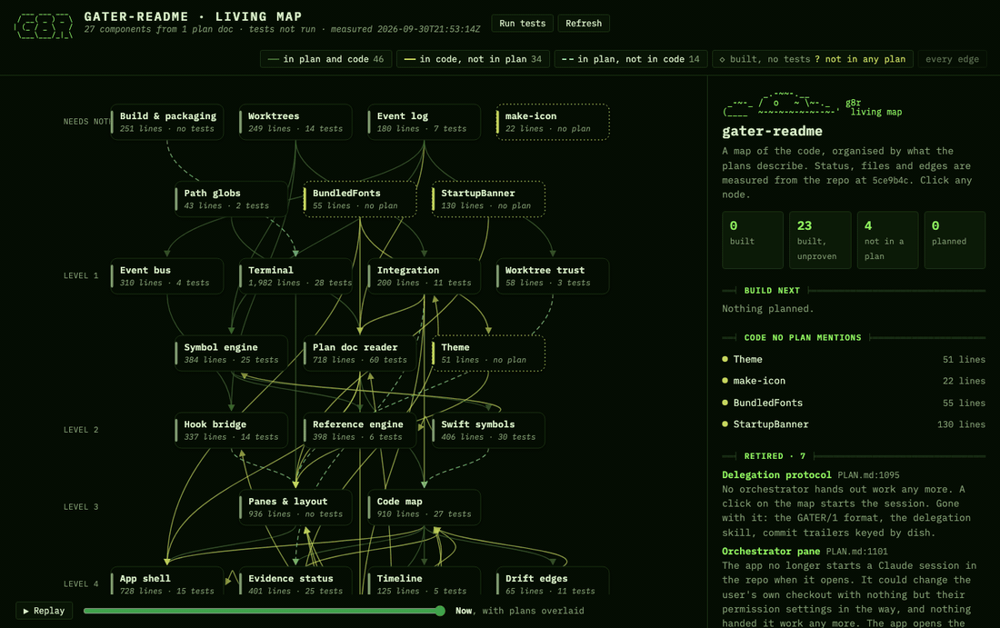
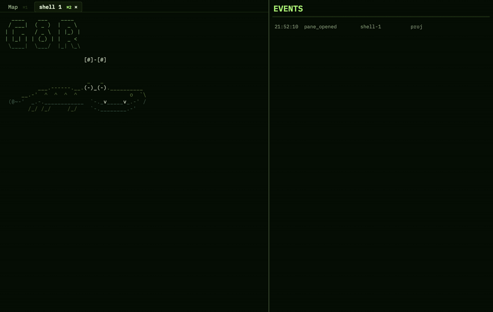
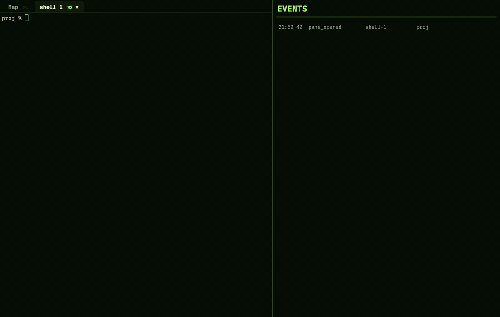
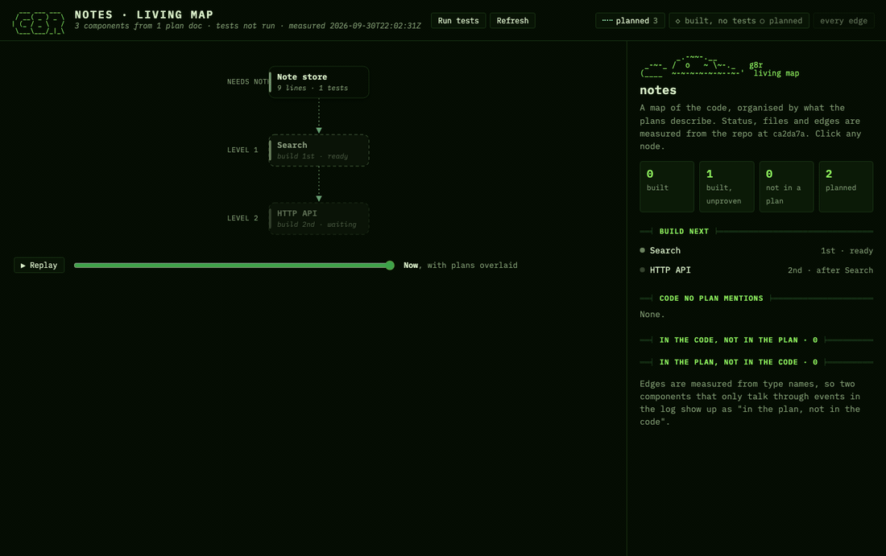

# g8r

g8r is a macOS terminal with a living map of your codebase beside it. The map is drawn from your plan docs. Each component is a node, and its status, files and edges are measured from the code, git and test runs. A component that isn't built yet can be built from the map, in its own agent session and worktree.



The terminal runs on [libghostty-vt](https://github.com/ghostty-org/ghostty). The agents are stock [Claude Code](https://code.claude.com) or [Codex](https://github.com/openai/codex): g8r watches what they do and doesn't change how they work. The design, and the plan g8r is built from, are in [PLAN.md](PLAN.md).

## Install

You need macOS on Apple Silicon, Xcode with Swift 6, and [Zig](https://ziglang.org) 0.16 (it builds libghostty-vt).

```sh
git clone --recurse-submodules https://github.com/kap-il/gater.git g8r
cd g8r
scripts/build-ghostty.sh        # builds Vendor/ghostty/GhosttyVT.xcframework
scripts/package-app.sh          # builds dist/G8r.app
cp -R dist/G8r.app /Applications/
ln -s "$PWD/scripts/g8r" /usr/local/bin/g8r   # or any folder on your PATH
```

The app is signed ad hoc, so it runs on the machine that built it. To wire up an agent you also need Claude Code or the Codex CLI on your `PATH`.

## Using it

Run `g8r` to open the folder you're in, or `g8r <path>`. Opened from Finder or the Dock, the app starts in your home folder.

g8r opens on a shell, which plays its banner. The map is the first tab, on ⌘1.



**The map follows your `cd`.** The project is wherever the active shell is: the top level of its git repository, else the nearest folder above it holding a plan (`PLAN.md`, `plans/`, `docs/plans/` or `g8r.json`), else the folder itself. `cd` into another project and the map, window title and event log switch to it. A `cd` within the same project changes nothing.



**Wiring an agent.** Type `claude` or `codex` in a g8r shell, with any arguments. g8r starts the real program with its hooks, so the session's edits, commands and turn ends show up in the Events feed, and gives it the `g8r-plan` skill, which teaches the plan format. Nothing is written to your repository, `~/.claude` or `~/.codex`; it is all passed per launch.

**Plans.** A plan in g8r's format is mapped directly, with no model involved:

```markdown
## search: Search
Finds notes by words in their title or body.
- Needs: store
- Code: src/search.py
- Done when: a query returns matching notes, best first.
```

Any level 2 to 4 heading shaped `id: Name` is a component. A free-form plan is read once by the agent and the result cached. A wired agent can also write a plan in this format for you.

**The map.** Each node is a component, with status measured from the code and tests rather than checkboxes. Edges compare the plan with the code: in both, in the code only, or in the plan only. Code no plan mentions gets its own node. Nodes are laid out in build order, unbuilt ones grayed out. The Replay slider rebuilds the map commit by commit.

**Build.** Select an unbuilt node and click Build. This needs a wired agent. g8r starts a fresh session in its own worktree, `../<repo>-<id>` on branch `g8r/<id>`, checks the result, merges it into `g8r/integration`, then closes the pane and removes the worktree. Merging `g8r/integration` into your branch is up to you. In a repository with no commits, or a folder without git, g8r offers to commit just the plan first.

**Change this.** On a built node, type what you want changed. g8r sends it to your wired agent along with the node's context.



**Folders without git** still get a map, a shell and an event log. History and builds turn on after `git init`.

## Shortcuts

| Keys | |
|---|---|
| ⌘1–⌘9 | Switch tabs (⌘1 is the map) |
| ⌘T | New shell, in the current shell's folder |
| ⌘⇧D | New delegate session in its own worktree |
| ⌘W | Close the focused pane |
| ⌘C / ⌘V | Copy / paste |
| ⌘↩ | Send the change box to your agent |

## Configuration

`g8r.json` at the project root (tracked), or `.g8r/config.json` (local, overrides it key by key):

```json
{ "plans": ["PLAN.md"], "build_command": "swift build", "test_command": "swift test", "agent": "claude" }
```

`agent` picks which agent reads free-form plans; Build always uses the agent you last started in a shell. Every key is in [PLAN.md](PLAN.md#g8rjson).

| Variable | |
|---|---|
| `G8R_AGENT` | `claude` or `codex`; overrides `agent` |
| `G8R_BUILD_COMMAND`, `G8R_TEST_COMMAND` | override `build_command` / `test_command` |
| `G8R_AGENT_COMMAND` | run a different program in session panes |
| `G8R_COLLECTOR` | event socket path (`scripts/g8r` sets one per folder) |
| `G8R_NO_BANNER` | skip the banner; `G8R_BANNER_DELAY` sets its frame time |
| `G8R_TSC` | a TypeScript 7 binary for the reference engine |
| `G8R_SNAPSHOT`, `G8R_SNAPSHOT_MAP` | write a PNG of the window or the map after 2 s |
| `G8R_RECORD` | write PNG frames to a folder (`G8R_RECORD_SECONDS`, `G8R_RECORD_MAP_AT`); see `scripts/demo/` |
| `G8R_DEBUG_CD`, `G8R_DEBUG_BUILD`, `G8R_DEBUG_DELEGATES` | debug runs: `cd` in the first shell, build a node, open delegates |

Snapshot and recording runs never bring the app to the front.

## What g8r writes

| Where | What |
|---|---|
| `<project>/.g8r/` | `events.jsonl` (the event log), test results, the free-form plan cache. Excluded from git via `.git/info/exclude` |
| `../<repo>-<id>`, `../<repo>-integration` | build worktrees, on `g8r/<id>` and `g8r/integration` |
| `~/.g8r/` | event sockets, the agent shims and skill (`shims/`), optional tools |
| `~/.claude.json` | trust entries for g8r's worktrees, only with **G8r → Auto-trust Delegate Worktrees** on |

## Repository layout

| Path | |
|---|---|
| `App/` | the macOS app: terminal view, panes, map view, event feed |
| `Sources/G8rCore` | plans, the code map, builds, worktrees, events, agents. No UI |
| `Sources/G8rCore/CodeMap/Viewer` | the map page, one self-contained HTML file |
| `Sources/G8rSymbols` | tree-sitter symbols (Swift, TypeScript, JavaScript) and references |
| `Sources/G8rTerminal`, `Sources/G8rPTY` | the libghostty-vt terminal core and the PTY |
| `Sources/g8r-hook` | the hook CLI the agents and shims call |
| `Sources/g8r-map` | the map as JSON or HTML: `swift run g8r-map --html .` |
| `scripts/` | build, package, the `g8r` launcher, demo capture |
| `Vendor/ghostty` | the Ghostty submodule |

## Development

```sh
scripts/build-ghostty.sh   # once
swift build
swift test
```

The language-server tests need TypeScript 7 in `~/.g8r/tools` and skip without it.

## Limitations

- Apple Silicon only, and signed ad hoc.
- Symbols are read for Swift, TypeScript and JavaScript only.
- The map follows the active shell only while g8r is the frontmost app.
- Build needs an agent started in a g8r shell during this run of the app.

## Third-party notices

g8r includes Ghostty (libghostty-vt), tree-sitter with its TypeScript and Swift grammars, SwiftTreeSitter, and the IBM Plex Mono font. Their licenses are in [THIRD_PARTY_NOTICES.md](THIRD_PARTY_NOTICES.md).
